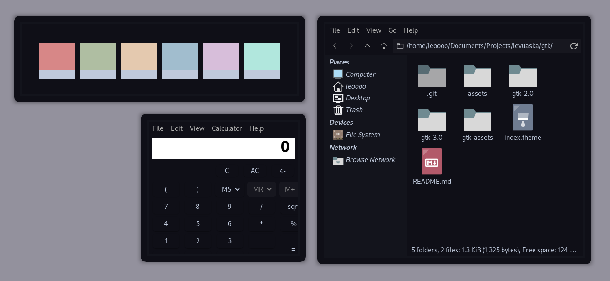

    
    <h1>Levuaska for GTK</h1>
    

    
    <a href="https://github.com/levuaska/gtk/network/members/">
        
    
    

</img>

<h2>Installation</h2>
  
- Clone this repository
- Move this to `~/.themes/`
- Change the GTK theme to levuaska.

<h2>Thanks<h2>

- [saimoomedits](https://github.com/saimoomedits)

